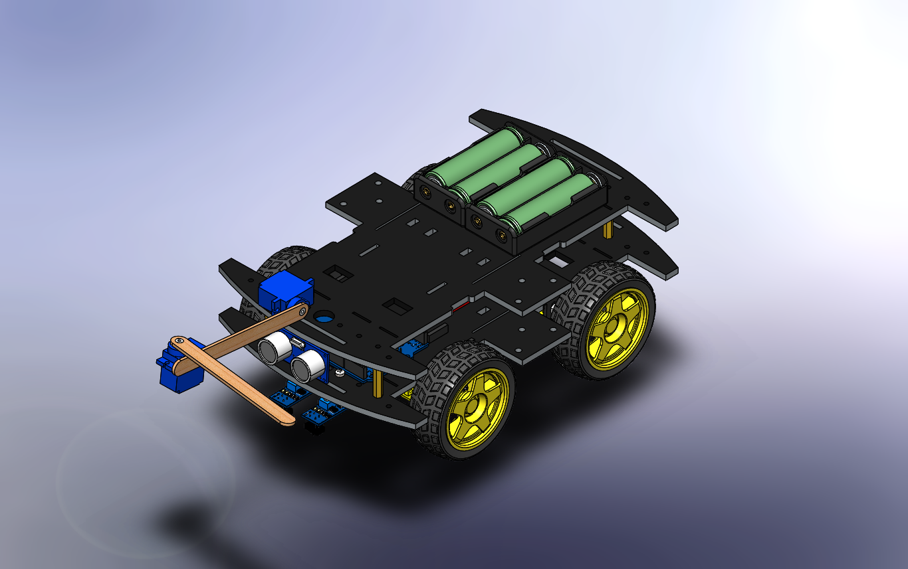

# Autonomous PD Line Follower & Obstacle Avoidance RC Car

An advanced, autonomous Mechatronics RC Car project integrating real-time line tracking via a PD control system and reactive obstacle avoidance capability.

---

## 📸 Project Showcase

Below is a preview of the vehicle design and hardware configuration find mechanical design here (https://grabcad.com/library/autonomous-pd-line-follower-obstacle-avoidance-rc-car-chassis-1):

---

## 🛠️ Project Repository Structure

This repository contains all the essential engineering and programming assets needed to replicate or build upon this project:

* **`code.ino`**: The main Arduino firmware implementing a custom PD (Proportional-Derivative) control loop for high-precision line following and state-machine transitions for obstacle avoidance.
* **`Proteus.zip`**: Compressed archive enclosing the complete electronics circuit schematic and hardware simulation layout designed in Proteus.
* **`RC_CAr_2TCRT5000_Ropo_hand.pdf`**: Comprehensive technical documentation detailing the system architecture, component specifications, calculations, and overall design methodologies.
* **`RC_CAr_2TCRT5000_Ropo_hand.PNG`**: High-resolution project image utilized for visual presentation and direct embedding within this README file.

---

## 🚀 Technical Highlights

### 1. Line Tracking with PD Control
The vehicle processes differential analog inputs from two infrared sensors (**TCRT5000**) to compute system tracking error. By evaluating both the instant error (Proportional) and its rate of change (Derivative), the firmware dynamically adjusts PWM outputs via the H-Bridge driver. This prevents control overshoot and eradicates aggressive side-to-side wobbling, ensuring smooth, linear tracking.

### 2. Ultrasonic Obstacle Avoidance
An **HC-SR04 Ultrasonic Sensor** constantly monitors the front pathway. If an obstacle is detected within a critical threshold ($\le 14\text{ cm}$), the vehicle immediately triggers an interrupt routine:
* Halting the main drive motors dynamically.
* Actuating a dual-servo scanning assembly (`SERVO_1` & `SERVO_2`) to sweep and clear the pathway before resuming nominal track operations.

---

## 🔌 Hardware Framework
* **Microcontroller:** Arduino Uno
* **Sensors:** HC-SR04 Ultrasonic Sensor & Dual TCRT5000 IR Sensors
* **Actuators:** Dual DC Gear Motors & Two High-Torque Servo Motors
* **Motor Driver:** PWM-Compliant H-Bridge Configuration

---

## 📨 Contact & Collaboration

If you have any questions regarding the mechanical design, control algorithms, or implementation details, feel free to reach out:

* **Developer:** Eslam (Abdelhamid) Abd El-Razek
* **Email:** [eslamelshick@gmail.com](mailto:eslamelshick@gmail.com)
* **Platform:** GitHub Layout & GrabCAD Electronics Deployment
